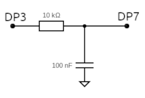

# Arduino Nano/Uno, DS18B20 temperature sensors over long wire, ENC28J60 ethernet, publish to local MQTT broker

Developed on [platformio](https://platformio.org/)
Up to 8 [ds18b20](https://datasheets.maximintegrated.com/en/ds/DS18B20.pdf) temperature sensors over one onewire line (up to 300m long).
Average of selected meridian values in Celsius from the sensors is published as mqtt message every time after all the sensors are sampled.

See Maxim application note AN244 "Advanced 1-Wire Network Driver" for circuit explanation. The part in blue is not used.

Connections to the Arduino Nano/uno:

- DPU (schematic above) connects to PD2 (digital output)
- DRIVE (schematic above) connects to PD4 (digital output)
- SENSE (schematic above) connects to PD6. PD6 is the positive input of the internal comparator.
- PD7 is the negative input of the internal comparator and this is the reference to detect the data read from the slave devices.
- PD3 outputs a PWM at 31kHz. When filtered through a RC filter it can used as the reference (connect through RC filter to PD7)
- PD5 is a digital output that can be used for debugging and fine tuning the timings on the oscilloscope.

There exist several types of modules around the ENC28J60 ethernet chip. For the Arduino Nano a shield exists.

[LICENSE](LICENSE)
